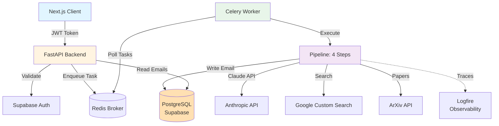
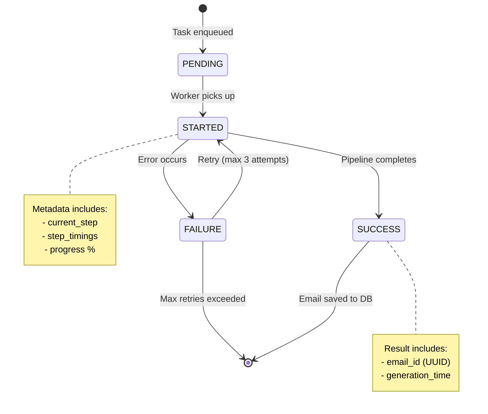

# Scribe Backend Architecture

> **Quick Start**: Async email generation platform using a 4-step AI pipeline. FastAPI handles requests, Celery workers run the pipeline, results stored in PostgreSQL.

## System Overview

### Architecture Diagram



**Tech Stack**:
- **Backend**: FastAPI (Python 3.13), SQLAlchemy, Alembic
- **Task Queue**: Celery 5.3+ with Redis (broker + results)
- **Database**: PostgreSQL via Supabase (direct connection, not SDK)
- **AI**: Anthropic Claude (Sonnet 4.5 for composition, Haiku 4.5 for analysis)
- **Web Scraping**: Playwright (headless Chrome), Google Custom Search API
- **Auth**: Supabase Auth (JWT validation only, all DB ops via backend)
- **Observability**: Logfire (distributed tracing, LLM call monitoring)

### Technology Stack Rationale

**Why FastAPI?**
- Native async/await support for concurrent operations
- Automatic Pydantic validation (request/response)
- Auto-generated OpenAPI documentation at `/docs`
- High performance (Uvicorn ASGI server)
- Excellent developer experience with type hints

**Why Anthropic Claude?**
- Superior instruction-following for structured output (vs GPT-3.5/4)
- Claude Haiku 4.5: Fast, cost-effective for extraction tasks
- Claude Sonnet 4.5: High-quality creative writing for email composition
- Built-in streaming support for future real-time generation
- Competitive pricing and rate limits

**Why Playwright?**
- Modern academic websites require JavaScript rendering
- Headless Chromium provides full browser environment
- Better scraping success rate vs httpx/requests (static HTML only)
- Isolated browser contexts prevent cross-contamination
- Production-ready with `--no-sandbox` for containers

**Why PostgreSQL + Supabase?**
- ACID-compliant transactions for data integrity
- JSONB support for flexible metadata storage
- Row-level security (RLS) for multi-tenancy
- Managed hosting reduces operational overhead
- Direct SQL access (not locked into Supabase SDK)

**Why Logfire?**
- Built by Pydantic team (native integration)
- Automatic LLM call instrumentation (prompts, tokens, cost)
- Distributed tracing across FastAPI → Celery → Pipeline
- Beautiful dashboards with zero configuration
- Affordable pricing for startups

---

## Request Flow

### Email Generation Lifecycle

1. **Client Request**  `POST /api/email/generate` with JWT token
2. **API Validates**  JWT  extracts user_id  creates Celery task  returns `task_id`
3. **Celery Queues**  Task written to Redis (db 0)
4. **Worker Picks Up**  Executes 4-step pipeline asynchronously
5. **Pipeline Runs**  Template analysis  web scraping  paper enrichment  email composition
6. **Database Write**  Final email saved to PostgreSQL
7. **Client Polls**  `GET /api/email/status/{task_id}`  returns PENDING/RUNNING/SUCCESS/FAILURE
8. **Client Retrieves**  `GET /api/email/{email_id}`  returns generated email

**Key Point**: Tasks take 10-25 seconds, so async processing prevents HTTP timeouts.

### Authentication Flow

```
Frontend  Supabase Auth (login)  JWT token
         
Backend  Validate JWT (get_supabase_user)  Extract user_id
         Lookup in local DB (get_current_user)  Proceed
```

**Security Model**:
- Frontend uses Supabase **only** for auth (OAuth, JWT)
- Backend uses Supabase **service role key** for full DB access
- **Never trust** `user_id` from request body—always extract from the validated JWT

---

## The Pipeline (4 Sequential Steps)

Each step enriches a shared `PipelineData` object passed through the chain. Data lives **in-memory only**—the final email is the only artifact persisted to the database.

### Step 1: Template Parser (`pipeline/steps/template_parser/`)
**What**: Analyzes email template using Claude Haiku 4.5
**Input**: Template text, recipient name, research interest
**Output**: `search_terms` (list), `template_type` (RESEARCH/BOOK/GENERAL)
**Example**: `"{{name}}'s work on {{research}}"`  `["Jane Smith machine learning", "Jane Smith publications"]`

### Step 2: Web Scraper (`pipeline/steps/web_scraper/`)
**What**: Fetches and summarizes web content
**Process**: Google Search (3 results/query)  Playwright scraping  LLM summarization
**Output**: `scraped_content` (max 3000 chars), `scraped_urls`
**Memory Constraint**: Sequential scraping (1 browser at a time due to 512MB RAM limit)

### Step 3: ArXiv Helper (`pipeline/steps/arxiv_helper/`)
**What**: Conditionally fetches academic papers (only if `template_type == RESEARCH`)
**Process**: Search ArXiv by author name → fetch top 5 papers
**Output**: `arxiv_papers` (list of {title, abstract, year, url})
**Note**: Skips entirely for BOOK/GENERAL templates

### Step 4: Email Composer (`pipeline/steps/email_composer/`)
**What**: Generates final email + writes to database
**Process**: Combines all data  Claude Sonnet 4.5 (creative writing)  DB insert
**Output**: `final_email`, `email_id` (UUID from database)
**Database Ops**:
- Insert into `emails` table
- Increment `user.generation_count`
- Store metadata (papers, sources, timings) in JSONB column

**Pipeline Data Flow**:
```
Input  [Step 1: +search_terms]  [Step 2: +scraped_content]
       [Step 3: +papers]  [Step 4: +final_email, email_id]  Database
```

---

## Celery + Redis Architecture

### Why Celery Over Alternatives?

| Feature | Celery + Redis | FastAPI BackgroundTasks | Custom DB Queue |
|---------|----------------|------------------------|-----------------|
| **Persistent State** | ✅ Redis | ❌ In-memory only | ✅ Database |
| **Poll Status** | ✅ AsyncResult API | ❌ No polling | ✅ Manual queries |
| **Horizontal Scaling** | ✅ Multiple workers | ❌ Tied to API instances | Complex |
| **Retry Logic** | ✅ Built-in | ❌ Manual implementation | ❌ Manual |
| **Worker Monitoring** | ✅ Flower UI | ❌ No visibility | Must build |
| **Operational Overhead** | Low | None | High |
| **Best For** | Long-running tasks | Quick background ops | When avoiding dependencies |

**Decision**: Email generation takes 10-25 seconds (too long for HTTP request/timeout). Celery provides production-ready async task processing with minimal code.

### Celery Task Lifecycle



### Redis Configuration
- **DB 0**: Celery broker (task queue)
- **DB 1**: Celery result backend (task state + results)
- **Task Expiration**: Results deleted after 1 hour
- **Connection Pool**: Max 10 connections (shared across workers)

### Worker Configuration
```python
# Memory-constrained for Render 512MB deployment
worker_concurrency = 1          # Only 1 task at a time
worker_prefetch_multiplier = 1  # Don't prefetch tasks
task_acks_late = True           # Requeue on worker crash
task_track_started = True       # Track STARTED state
result_expires = 3600           # Results kept for 1 hour
```

**Production Scaling**: When upgraded to 1GB+ RAM, increase `worker_concurrency` to 2-4 for parallel execution.

### Task States
- **PENDING**: Queued in Redis, waiting for worker
- **STARTED**: Worker picked up task, includes `current_step` in metadata
- **SUCCESS**: Pipeline completed, includes `email_id`
- **FAILURE**: Error occurred, includes `error` and `failed_step`
- **RETRY**: Automatic retry with exponential backoff (1s, 2s, 4s delays)

### Monitoring
```bash
make flower  # Flower UI at localhost:5555
# View: Active tasks, completed tasks, worker stats, task history
```

---

## Directory Structure

| Directory | Purpose |
|-----------|---------|
| `api/` | FastAPI routes (`user.py`, `email.py`) and auth dependencies |
| `models/` | SQLAlchemy ORM models (`User`, `Email`) |
| `schemas/` | Pydantic request/response validation schemas |
| `database/` | DB engine, session management, connection utilities |
| `pipeline/` | 4-step email generation pipeline |
| `pipeline/core/` | `PipelineRunner`, `BasePipelineStep` base classes |
| `pipeline/steps/` | Individual step implementations (template_parser, web_scraper, etc.) |
| `tasks/` | Celery task definitions (`generate_email_task`) |
| `config/` | Pydantic Settings (env vars, Redis config) |
| `services/` | External service clients (Supabase) |
| `alembic/` | Database migrations |
| `observability/` | Logfire configuration for distributed tracing |
| `utils/` | Shared utilities (LLM agent factory) |

---

## Key Files to Know

| File | Purpose |
|------|---------|
| `main.py` | FastAPI app entry point, router registration, startup checks |
| `celery_config.py` | Celery app config, worker settings, Redis connection |
| `tasks/email_tasks.py` | `generate_email_task` - orchestrates pipeline execution |
| `pipeline/__init__.py` | `create_email_pipeline()` factory - registers 4 steps |
| `pipeline/core/runner.py` | `PipelineRunner` - executes steps sequentially with observability |
| `database/base.py` | SQLAlchemy engine, session factory, connection pooling |
| `config/settings.py` | Environment variable validation (Pydantic Settings) |
| `api/dependencies.py` | `get_current_user()` - JWT validation + user lookup |

---

## Database Schema

### Users Table
```python
id              UUID (PK, from Supabase auth.users)
email           String (unique, indexed)
display_name    String (optional)
generation_count Integer (tracks usage)
created_at      DateTime
```

### Emails Table
```python
id                UUID (PK, auto-generated)
user_id           UUID (FK  users, CASCADE delete)
recipient_name    String
recipient_interest String
email_message     Text (generated content)
template_type     Enum (RESEARCH | BOOK | GENERAL)
metadata          JSONB (papers, sources, timings, model info)
created_at        DateTime (indexed)
```

**Indexes**:
- `users.email` (unique)
- `emails.user_id` + `emails.created_at` (composite for user history queries)

---

## Common Tasks

### Run Locally
```bash
# 1. Start Redis
make redis-start

# 2. Start API + Celery worker (both in one command)
make serve

# Or separately:
uvicorn main:app --reload          # API only
celery -A celery_config.celery_app worker --loglevel=info  # Worker only
```

### Add a New Pipeline Step
1. **Create step class** in `pipeline/steps/my_step/main.py`:
   ```python
   from pipeline.core.runner import BasePipelineStep

   class MyStep(BasePipelineStep):
       async def _execute_step(self, data: PipelineData) -> StepResult:
           # Your logic here
           data.my_output = "result"
           return StepResult(success=True)
   ```

2. **Register in pipeline factory** (`pipeline/__init__.py`):
   ```python
   runner.register_step(MyStep())
   ```

3. **Update PipelineData model** (`pipeline/models/core.py`):
   ```python
   @dataclass
   class PipelineData:
       my_output: Optional[str] = None  # Add your fields
   ```

### Debug a Failed Task
```bash
# 1. Check worker logs
tail -f worker.log

# 2. Inspect task in Python
from celery_config import celery_app
task = celery_app.AsyncResult('task_id')
print(task.state, task.info)

# 3. Check Logfire traces (if configured)
# Visit: https://logfire.pydantic.dev
```

### Database Migrations
```bash
# After changing models in models/
make migration MSG="add new field"  # Creates migration
make migrate                         # Applies migration
make db-current                      # Shows current version
```

---

## Key Architectural Decisions

### Stateless Pipeline Design (In-Memory State)

**Philosophy**: Pipeline state lives entirely in a `PipelineData` object passed through all 4 steps. No intermediate database writes—only the final email is persisted.

**How It Works**:
```python
# All pipeline state in a single dataclass
@dataclass
class PipelineData:
    # Inputs
    task_id: str
    user_id: str
    template: str
    recipient_name: str

    # Step outputs (populated during execution)
    search_terms: List[str] = field(default_factory=list)       # Step 1
    scraped_content: str = ""                                   # Step 2
    arxiv_papers: List[Dict] = field(default_factory=list)      # Step 3
    final_email: str = ""                                       # Step 4
```

**Benefits**:
1. **Simplified Debugging**: All context captured in single Logfire trace, no scattered DB queries
2. **Reduced DB Load**: 1 write per job instead of 4+ writes per step
3. **Idempotent Retries**: Re-running pipeline from start is safe (no partial state in DB)
4. **Performance**: No I/O between steps, all operations in RAM
5. **Observability**: Logfire traces contain full execution history

**Trade-offs**:
- ❌ Can't resume mid-pipeline on failure (must restart from Step 1)
- ✅ Full execution takes 10-25s, so retries are acceptable
- ❌ No historical step-by-step data in database
- ✅ Logfire provides better debugging than DB queries

**Comparison with Stateful Approach**:

| Aspect | Stateless (Our Choice) | Stateful (Database-Backed) |
|--------|------------------------|----------------------------|
| **DB Writes** | 1 (final result only) | 4+ (each step + status updates) |
| **Resume on Failure** | ❌ Restart from beginning | ✅ Resume from failed step |
| **Debugging** | Logfire traces | Complex DB queries |
| **Horizontal Scaling** | ✅ No DB contention | ⚠️ Row locking issues |
| **Code Complexity** | Low | High (transaction management) |

### Celery Over FastAPI BackgroundTasks
**Why**: Persistent task state in Redis, client can poll status, horizontal scaling with multiple workers
**Alternative**: BackgroundTasks can't be polled or resumed after server restart

### Backend-First (No Direct DB Access from Frontend)
**Why**: Security (enforce authorization), flexibility (change DB schema without frontend changes), centralized business logic
**Trade-off**: Extra API latency vs direct Supabase client queries

### Memory-Constrained Design (Sequential Scraping)
**Context**: Render free tier = 512MB RAM, Playwright browser = ~150MB per instance
**Solution**: `max_concurrent_scrapes = 1` (sequential, not parallel)
**Measurement**: Scraping 3 URLs sequentially takes ~4s (acceptable overhead)
**Future**: Increase concurrency to 2-3 when upgraded to 1GB+ RAM for 50% faster execution

---

## Observability

### Logfire Tracing
Every pipeline execution creates a trace with nested spans:
```
pipeline.full_run
├─ pipeline.template_parser
│  └─ pydantic_ai.agent.run (auto-instrumented)
├─ pipeline.web_scraper
│  ├─ google_search
│  ├─ playwright.scrape_url
│  └─ pydantic_ai.agent.run (summarization)
└─ pipeline.email_composer
   ├─ pydantic_ai.agent.run (composition)
   └─ db.write_email
```

**Metrics Tracked**:
- Step timings, LLM token usage, scraping success rate, total cost per email

---

## Deployment (Render)

### Overview

Scribe deploys to **Render.com** with a three-service architecture:
1. **Web Service** (FastAPI API)
2. **Worker Service** (Celery background worker)
3. **Redis** (managed instance for Celery broker + results)

Both Web and Worker services use the **free tier (512MB RAM)**, optimized for memory-constrained execution.

---

### render.yaml Configuration

The `render.yaml` file in project root defines all infrastructure as code:

```yaml
services:
  # FastAPI Web Service
  - type: web
    name: scribe-api
    env: python
    plan: free                    # 512MB RAM
    buildCommand: ./build.sh      # Custom build script
    startCommand: uvicorn main:app --host 0.0.0.0 --port $PORT --timeout-keep-alive 180
    envVars:
      - fromGroup: scribe-backend  # Shared environment variable group

  # Celery Worker Service
  - type: worker
    name: scribe-celery
    env: python
    plan: free                    # 512MB RAM (separate from web)
    buildCommand: pip install -r requirements.txt
    startCommand: celery -A celery_config.celery_app worker -Q email_default,celery --loglevel=info
    envVars:
      - fromGroup: scribe-backend  # Same env vars as web service
```

**Key Configuration Notes**:
- **Separate instances**: Web and Worker run in isolated containers (each gets 512MB)
- **Shared env vars**: `scribe-backend` group contains all secrets (API keys, database credentials)
- **Queue names**: Worker listens to `email_default` and `celery` queues
- **Timeout**: 180s keep-alive for long-polling requests

---

### Build Process (build.sh)

**Executed during deployment** for both services:

```bash
#!/usr/bin/env bash
set -o errexit  # Fail fast on errors

# 1. Install Python dependencies
pip install -r requirements.txt

# 2. Install Playwright Chromium browser (~300MB)
python -m playwright install chromium
```

**Build Optimizations**:
- **Browser caching**: Chromium binaries cached in `/opt/render/project/.cache` (persistent across deploys)
- **Build time**: ~3-5 minutes first deploy, ~1-2 minutes subsequent deploys (cached dependencies)
- **Disk usage**: ~450MB total (dependencies + Chromium)

**Production Playwright Configuration**:
- Runs headless with `--no-sandbox` flag (required for containers)
- Isolated browser contexts prevent memory leaks
- Sequential scraping (`max_concurrent=1`) to stay within 512MB RAM limit

---

### Environment Variables

**Required Variables** (stored in Render `scribe-backend` env group):

| Variable | Purpose | Example |
|----------|---------|---------|
| `SUPABASE_URL` | Database connection | `https://xxx.supabase.co` |
| `SUPABASE_SERVICE_ROLE_KEY` | Backend auth (service role) | `eyJ...` (JWT) |
| `CELERY_BROKER_URL` | Redis broker connection | `redis://red-xxx.render.com:6379/0` |
| `CELERY_RESULT_BACKEND` | Redis results storage | `redis://red-xxx.render.com:6379/1` |
| `ANTHROPIC_API_KEY` | Claude API access | `sk-ant-...` |
| `GOOGLE_API_KEY` | Custom Search API | `AIza...` |
| `GOOGLE_CSE_ID` | Search engine ID | `012345...` |
| `LOGFIRE_TOKEN` | Observability platform | `lf_...` |
| `ENVIRONMENT` | Deployment env | `production` |

**Security Best Practices**:
- ✅ Never commit secrets to git (use Render dashboard or CLI)
- ✅ Rotate API keys quarterly
- ✅ Use separate Logfire projects for staging/production
- ✅ Enable Supabase RLS policies for defense-in-depth

---

### Resource Limits & Scaling

#### Free Tier Constraints

| Resource | Web Service | Worker Service | Total |
|----------|-------------|----------------|-------|
| **RAM** | 512MB | 512MB | 1GB |
| **CPU** | Shared (0.1 CPU) | Shared (0.1 CPU) | 0.2 CPU |
| **Disk** | 512MB ephemeral | 512MB ephemeral | 1GB |
| **Network** | 100GB/month | 100GB/month | Shared quota |

#### Worker Concurrency Configuration

**Current Settings** (free tier):
```python
# celery_config.py
worker_concurrency = 1          # Only 1 task at a time
worker_prefetch_multiplier = 1  # Don't prefetch tasks
worker_max_memory_per_child = 450_000  # Kill worker at 450MB (before OOM)
```

**Memory Breakdown** (per worker process):
- Base Python + FastAPI: ~80MB
- Playwright Chromium: ~150MB (when scraping)
- Pipeline overhead: ~50MB
- Available buffer: ~232MB
- **Total: ~512MB**

**Scaling Strategy** (when upgraded to paid tier):

| Plan | RAM | Recommended Concurrency | Throughput |
|------|-----|------------------------|------------|
| Free | 512MB | 1 task | ~6 emails/minute |
| Starter | 1GB | 2 tasks | ~12 emails/minute |
| Standard | 2GB | 4 tasks | ~24 emails/minute |

**Horizontal Scaling**:
- Add more worker instances (not just increase concurrency)
- Load balances automatically via Redis queue
- No code changes required

---

### Playwright in Production

#### Why Playwright Works on Render

Modern academic websites require JavaScript rendering, which Playwright handles via headless Chromium:

**Container-Safe Configuration**:
```python
# pipeline/steps/web_scraper/utils.py
browser = await playwright.chromium.launch(
    headless=True,          # No GUI
    args=['--no-sandbox']   # Required for Render containers (no root)
)
```

**Memory Management**:
- Each browser context: ~150MB
- Sequential scraping prevents multiple browsers in RAM
- Automatic cleanup with `async with` context managers

**Build Artifact Size**:
- Chromium binaries: ~300MB
- Cached in `/opt/render/project/.cache/ms-playwright/`
- Persistent across deploys (no re-download unless version changes)

**Troubleshooting**:
- If scraping fails, check logs for `--no-sandbox` errors
- Ensure `playwright install chromium` runs in `build.sh`
- Verify disk space available (Chromium needs ~350MB)

---

### Logfire Observability in Production

#### Setup

**1. Create Logfire Project**:
```bash
# Visit https://logfire.pydantic.dev
# Create project: "scribe-production"
# Copy token
```

**2. Configure Backend**:
```python
# observability/logfire_config.py
import logfire

logfire.configure(
    token=os.getenv("LOGFIRE_TOKEN"),
    service_name="scribe-api",
    environment="production",
    send_to_logfire=True
)
```

**3. Add to FastAPI**:
```python
# main.py
from observability.logfire_config import configure_logfire

configure_logfire()  # Before app creation
app = FastAPI()
logfire.instrument_fastapi(app)
```

#### What Gets Logged

**Automatic Instrumentation**:
- ✅ All FastAPI requests (path, method, status, duration)
- ✅ Database queries (SQLAlchemy integration)
- ✅ Celery task lifecycle (enqueue, start, success, failure)
- ✅ Pydantic-AI LLM calls (prompts, tokens, cost, latency)

**Custom Spans**:
```python
with logfire.span("pipeline.step_name", task_id=task_id):
    logfire.info("Step started", metadata={"foo": "bar"})
    result = await execute_step()
    logfire.info("Step completed", result=result)
```

**Metrics Tracked**:
- Pipeline execution time by template type
- Cost per email (LLM token usage)
- Scraping success rate
- Worker queue depth

#### Monitoring & Alerts

**Dashboards**:
- **Overview**: Requests/min, error rate, P95 latency
- **Pipeline**: Step timings, success rate, cost per email
- **Workers**: Active tasks, queue depth, OOM kills

**Alerts** (configure in Logfire UI):
- Pipeline failure rate >5% in 5 minutes
- Worker queue depth >10 tasks
- P95 latency >30 seconds
- Memory usage >90% (predict OOM kills)

---

### Production Best Practices

#### 1. Database Connection Pooling

```python
# database/base.py
engine = create_engine(
    settings.DATABASE_URL,
    poolclass=QueuePool,
    pool_size=5,              # Max 5 connections per service
    max_overflow=10,          # Burst to 15 total
    pool_pre_ping=True,       # Verify connection before use
    pool_recycle=3600         # Recycle connections hourly
)
```

**Why**: Prevent Supabase connection limit exhaustion (max 60 on free tier)

#### 2. Celery Task Timeouts

```python
# celery_config.py
task_soft_time_limit = 300    # Warn at 5 minutes
task_time_limit = 360         # Kill at 6 minutes
```

**Why**: Prevent hung tasks from blocking worker indefinitely

#### 3. Graceful Shutdown

```python
# main.py
@app.on_event("shutdown")
async def shutdown():
    await engine.dispose()    # Close DB connections
    await redis.close()       # Close Redis connections
    logfire.info("Shutdown complete")
```

**Why**: Clean up resources before container restarts (Render auto-restarts weekly)

#### 4. Health Checks

```python
# api/routes/health.py
@router.get("/health")
async def health_check(db: Session = Depends(get_db)):
    # 1. Check database
    db.execute(text("SELECT 1"))

    # 2. Check Celery broker
    celery_app.control.inspect().ping()

    # 3. Check Redis
    await redis.ping()

    return {"status": "healthy", "timestamp": datetime.utcnow()}
```

**Why**: Render uses `/health` endpoint to detect unhealthy services and auto-restart

---

### Common Deployment Issues

| Problem | Symptom | Solution |
|---------|---------|----------|
| **Out of Memory (OOM)** | Worker killed mid-task, logs show "Killed" | Reduce `worker_concurrency` to 1, enable `worker_max_memory_per_child` |
| **Playwright fails** | `Browser closed unexpectedly` | Add `--no-sandbox` arg, verify Chromium installed in build |
| **Celery can't connect to Redis** | Tasks stay PENDING forever | Check `CELERY_BROKER_URL` matches Render Redis internal URL |
| **Database connection pool exhausted** | `TimeoutError: QueuePool limit` | Reduce `pool_size` or upgrade Supabase plan |
| **Slow first request** | 10s+ latency on cold start | Use Render paid tier to prevent container spin-down |
| **Missing environment variables** | `KeyError` or `ValidationError` at startup | Verify all vars in `scribe-backend` group, restart service |

---

### Deployment Checklist

**Pre-Deploy**:
- [ ] Run tests locally: `pytest`
- [ ] Verify migrations: `alembic upgrade head`
- [ ] Check environment variables in Render dashboard
- [ ] Review Logfire logs for recent errors

**Deploy**:
- [ ] Push to main branch (auto-deploys via GitHub integration)
- [ ] Monitor build logs in Render dashboard
- [ ] Verify health endpoint: `https://scribe-api.onrender.com/health`

**Post-Deploy**:
- [ ] Test email generation end-to-end
- [ ] Check Logfire for errors in first 10 minutes
- [ ] Monitor worker queue depth
- [ ] Verify no OOM kills in logs

---

### Upgrade Path (Free → Paid)

**When to Upgrade**:
- Consistent queue depth >5 tasks
- Memory usage >90% (frequent OOM kills)
- Need faster response times (cold starts on free tier)

**Recommended Upgrade** ($7/month per service):
- **Starter Plan**: 1GB RAM, no cold starts, 400 hours/month
- **Worker Concurrency**: Increase to 2 tasks simultaneously
- **Database**: Upgrade Supabase to Pro ($25/month) for connection pooling

**Expected Performance Gain**:
- 2x throughput (12 emails/minute vs 6)
- 50% faster cold starts (no container spin-down)
- 99.9% uptime (vs 95% on free tier)

---

## Troubleshooting

| Problem | Solution |
|---------|----------|
| Worker not picking up tasks | Check Redis: `make redis-ping`, restart worker |
| Playwright scraping fails | Reinstall: `python -m playwright install chromium` |
| Database connection errors | Validate `.env` with `make check-env` |
| Task stuck in PENDING | Check worker logs, inspect with `AsyncResult(task_id)` |
| Out of memory errors | Reduce `max_concurrent_scrapes` or upgrade RAM |

---

## Testing

```bash
# Run all tests
pytest

# Run specific step tests
pytest pipeline/steps/template_parser/

# Run with markers
pytest -m unit              # Fast unit tests only
pytest -m "not slow"        # Skip integration tests

# Coverage report
pytest --cov=pipeline --cov-report=html
```

**Important**: Always run from project root and use virtual environment:
```bash
source venv/bin/activate
pytest
```

---

## Further Reading

- **Quick Start**: [QUICKSTART.MD](QUICKSTART.MD) - Get running in 5 minutes
- **Pipeline Deep Dive**: [PIPELINE.MD](PIPELINE.MD) - 4-step pipeline implementation
- **Development Guide**: [DEVELOPMENT.MD](DEVELOPMENT.MD) - Dev workflows, testing, debugging
- **API Reference**: [API_REFERENCE.MD](API_REFERENCE.MD) - Complete API documentation
- **API Docs (Swagger)**: http://localhost:8000/docs - Interactive API testing
- **Logfire Dashboard**: https://logfire.pydantic.dev - Observability and monitoring

---

*Last updated: 2025-01-24*
