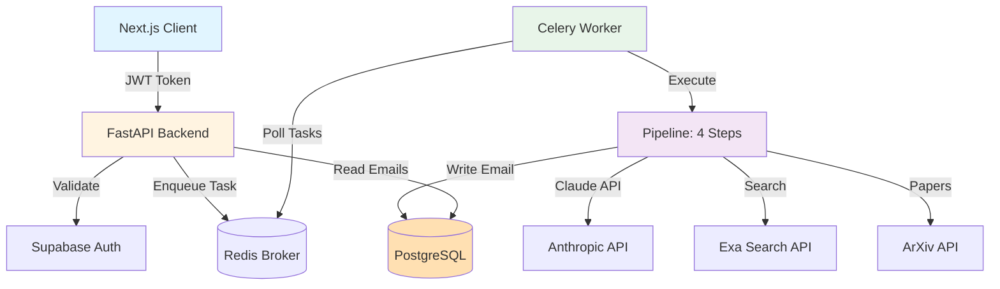

# Scribe Backend Architecture

> **System design: async email generation platform using a 4-step AI pipeline.**

---

## System Overview



**Tech Stack**:
- **Backend**: FastAPI (Python 3.13), SQLAlchemy, Alembic
- **Task Queue**: Celery 5.3+ with Redis
- **Database**: PostgreSQL via Supabase transaction pooler (port 6543)
- **AI**: Anthropic Claude, Fireworks AI (Kimi K2p5 - hot-swappable)
- **Web Search**: Exa Search API
- **Auth**: Supabase Auth (JWT validation only)
- **Observability**: Logfire (distributed tracing, LLM monitoring)

### Technology Rationale

**Why FastAPI?**
- Native async/await for concurrent operations
- Automatic Pydantic validation
- Auto-generated OpenAPI docs at `/docs`
- High performance (Uvicorn ASGI)

**Why Anthropic Claude / Fireworks AI?**
- Superior instruction-following for structured output
- Claude Haiku 4.5: Fast extraction tasks
- Claude Sonnet 4.5: High-quality creative writing
- Fireworks Kimi K2p5: Cost-effective alternative (hot-swappable via env vars)

**Why Exa Search?**
- Modern dual-query strategy (background + publications)
- Better than traditional Google Custom Search for academic content
- Automatic citation extraction

**Why PostgreSQL + Supabase?**
- ACID transactions, JSONB support
- Managed hosting, row-level security (RLS)
- Direct SQL access (not locked into Supabase SDK)
- Transaction pooler for auto-scaling

**Why Logfire?**
- Built by Pydantic team (native integration)
- Automatic LLM call instrumentation
- Distributed tracing across FastAPI → Celery → Pipeline

---

## Request Flow

### Email Generation Lifecycle

1. **Client Request** → `POST /api/email/generate` with JWT
2. **API Validates** → JWT → extracts user_id → creates Celery task → returns `task_id`
3. **Celery Queues** → Task written to Redis
4. **Worker Executes** → 4-step pipeline (10-25 seconds)
5. **Database Write** → Final email saved to PostgreSQL
6. **Client Polls** → `GET /api/email/status/{task_id}` → PENDING/STARTED/SUCCESS/FAILURE
7. **Client Retrieves** → `GET /api/email/{email_id}` → email content

**Key Point**: Async processing prevents HTTP timeouts (tasks take 10-25s).

### Authentication Flow

```
Frontend → Supabase Auth (login) → JWT token
Backend → Validate JWT → Extract user_id → Lookup local DB → Proceed
```

**Security Model**:
- Frontend uses Supabase **only** for auth
- Backend uses service role key for full DB access
- **Never trust** `user_id` from request body—always from validated JWT

---

## The 4-Step Pipeline

Each step enriches a shared `PipelineData` object. Only the final email is persisted to database.

### Step 1: Template Parser
**What**: Analyzes template using Claude/Kimi
**Input**: Template text, recipient info
**Output**: `search_terms` (list), `template_type` (RESEARCH/BOOK/GENERAL)
**Example**: `"{{name}}'s work on {{research}}"` → `["Jane Smith machine learning", "Jane Smith publications"]`

### Step 2: Web Scraper
**What**: Dual-query search via Exa API
**Process**:
- Query 1: Background (affiliations, bio)
- Query 2: Publications (books/papers based on template_type)
- Combines results with citations
**Output**: `scraped_content` (with citations), `scraped_urls`

### Step 3: ArXiv Helper
**What**: Fetches academic papers (only if `template_type == RESEARCH`)
**Process**: Search ArXiv by author → fetch top 5 papers
**Output**: `arxiv_papers` (title, abstract, year, url)
**Note**: Skipped for BOOK/GENERAL templates

### Step 4: Email Composer
**What**: Generates final email + writes to DB
**Process**: Combines all data → Claude Sonnet/Kimi → DB insert
**Output**: `final_email`, `email_id` (UUID)
**Database Ops**:
- Insert into `emails` table
- Increment `user.generation_count`
- Store metadata (papers, sources, timings) in JSONB

**Pipeline Data Flow**:
```
Input → [Step 1: +search_terms] → [Step 2: +scraped_content]
      → [Step 3: +papers] → [Step 4: +final_email, email_id] → Database
```

---

## Celery + Redis Architecture

### Why Celery?

| Feature | Celery + Redis | FastAPI BackgroundTasks |
|---------|----------------|------------------------|
| Persistent State | ✅ Redis | ❌ In-memory |
| Poll Status | ✅ AsyncResult API | ❌ No polling |
| Horizontal Scaling | ✅ Multiple workers | ❌ Tied to API instances |
| Retry Logic | ✅ Built-in | ❌ Manual |
| Worker Monitoring | ✅ Flower UI | ❌ No visibility |

**Decision**: Tasks take 10-25s (too long for HTTP). Celery provides production-ready async processing.

### Task Lifecycle

```
PENDING → STARTED → SUCCESS
            ↓
         FAILURE (with retries)
```

**Task States**:
- **PENDING**: Queued, waiting for worker
- **STARTED**: Worker picked up, includes `current_step` metadata
- **SUCCESS**: Pipeline complete, includes `email_id`
- **FAILURE**: Error occurred, includes `error` and `failed_step`

### Redis Configuration
- **DB 0**: Celery broker (task queue)
- **DB 1**: Celery result backend (task state + results)
- **Expiration**: Results deleted after 1 hour
- **Connection Pool**: Max 10 connections

### Worker Configuration
```python
# Memory-constrained for 512MB deployment
worker_concurrency = 1          # One task at a time
worker_prefetch_multiplier = 1  # Don't prefetch
task_acks_late = True           # Requeue on crash
task_track_started = True       # Track STARTED state
result_expires = 3600           # 1 hour TTL
```

**Scaling**: Upgrade to 1GB+ RAM → increase `worker_concurrency` to 2-4.

---

## Database Schema

### Users Table
```python
id              UUID (PK, from Supabase auth.users)
email           String (unique, indexed)
display_name    String (optional)
generation_count Integer
template_count  Integer
onboarded       Boolean
email_template  Text (nullable)
created_at      DateTime
```

### Emails Table
```python
id                UUID (PK)
user_id           UUID (FK → users, CASCADE delete)
recipient_name    String
recipient_interest String
email_message     Text
template_type     Enum (RESEARCH | BOOK | GENERAL)
metadata          JSONB (papers, sources, timings)
is_confident      Boolean
displayed         Boolean (soft delete)
created_at        DateTime (indexed)
```

### QueueItems Table
```python
id                  UUID (PK)
user_id             UUID (FK → users, CASCADE delete)
recipient_name      String
recipient_interest  String
email_template_text Text
status              Enum (PENDING | PROCESSING | COMPLETED | FAILED)
celery_task_id      String (nullable)
current_step        String (nullable)
email_id            UUID (FK → emails, SET NULL)
error_message       String (max 1000 chars, truncated)
started_at          DateTime (nullable)
completed_at        DateTime (nullable)
created_at          DateTime (indexed for FIFO)
```

**Indexes**:
- `users.email` (unique)
- `emails.user_id` + `emails.created_at` (composite)
- `queue_items.user_id`, `queue_items.status`, `queue_items.created_at`

---

## Directory Structure

| Directory | Purpose |
|-----------|---------|
| `api/` | FastAPI routes and auth dependencies |
| `models/` | SQLAlchemy ORM models |
| `schemas/` | Pydantic request/response validation |
| `database/` | DB engine, sessions, connection utils |
| `pipeline/` | 4-step email generation pipeline |
| `pipeline/core/` | `PipelineRunner`, `BasePipelineStep` |
| `pipeline/steps/` | Step implementations |
| `tasks/` | Celery task definitions |
| `config/` | Pydantic Settings (env vars) |
| `services/` | External service clients (Supabase, template generator) |
| `alembic/` | Database migrations |
| `observability/` | Logfire configuration |
| `utils/` | Shared utilities (LLM agents, PDF parser) |

---

## Key Architectural Decisions

### 1. Stateless Pipeline Design

**Philosophy**: Pipeline state lives in `PipelineData` object. No intermediate DB writes—only final email persisted.

**Benefits**:
- Simplified debugging (full trace in Logfire)
- Reduced DB load (1 write vs 4+)
- Idempotent retries (no partial state)
- Better performance (all in RAM)

**Trade-offs**:
- ❌ Can't resume mid-pipeline (must restart from Step 1)
- ✅ Tasks only take 10-25s, retries are acceptable

### 2. Backend-First (No Direct DB Access from Frontend)

**Why**: Security (enforce authorization), flexibility (schema changes don't break frontend), centralized business logic

**Trade-off**: Extra API latency vs direct Supabase client queries

### 3. Transaction Pooler (Port 6543)

**Why**: Supabase's Supavisor handles connection pooling server-side
**How**: NullPool (no client-side pooling) creates fresh connections per request
**Benefit**: Eliminates stale connections, optimal for auto-scaling (Render.com)

### 4. Memory-Constrained Design

**Context**: Render free tier = 512MB RAM
**Solution**: Sequential processing (`concurrency=1`), single worker
**Measurement**: Each task ~400MB with Playwright browser
**Future**: Upgrade to 1GB+ → increase concurrency to 2-4

### 5. Hot-Swappable LLM Models

**Implementation**: Environment variables control model selection
**Current Defaults**:
- Template Parser: `fireworks:accounts/fireworks/models/kimi-k2p5`
- Email Composer: `fireworks:accounts/fireworks/models/kimi-k2p5`
**Benefit**: Switch providers without code changes (cost optimization)

---

## Deployment (Render.com)

### Three-Service Architecture

1. **Web Service** (FastAPI) - 512MB RAM, handles HTTP requests
2. **Worker Service** (Celery) - 512MB RAM, processes background tasks
3. **Redis** (managed) - Broker + result backend

### Key Configuration

**Web Service**:
```yaml
buildCommand: ./build.sh
startCommand: uvicorn main:app --host 0.0.0.0 --port $PORT --timeout-keep-alive 180
```

**Worker Service**:
```yaml
buildCommand: pip install -r requirements.txt
startCommand: celery -A celery_config.celery_app worker -Q email_default,celery --loglevel=info
```

**Build Script** (`build.sh`):
```bash
pip install -r requirements.txt
python -m playwright install chromium  # ~300MB, cached
```

### Environment Variables (Required)

```bash
# Database
SUPABASE_URL, SUPABASE_SERVICE_ROLE_KEY

# Redis
CELERY_BROKER_URL=redis://red-xxx.render.com:6379/0
CELERY_RESULT_BACKEND=redis://red-xxx.render.com:6379/1

# APIs
ANTHROPIC_API_KEY, FIREWORKS_API_KEY, EXA_API_KEY

# LLM Models (hot-swappable)
TEMPLATE_PARSER_MODEL=fireworks:accounts/fireworks/models/kimi-k2p5
EMAIL_COMPOSER_MODEL=fireworks:accounts/fireworks/models/kimi-k2p5

# Observability
LOGFIRE_TOKEN
```

### Resource Limits (Free Tier)

| Resource | Web | Worker | Total |
|----------|-----|--------|-------|
| RAM | 512MB | 512MB | 1GB |
| CPU | 0.1 | 0.1 | 0.2 |
| Disk | 512MB | 512MB | 1GB |

**Memory Breakdown** (per worker):
- Python + FastAPI: ~80MB
- Playwright Chromium: ~150MB (when active)
- Pipeline overhead: ~50MB
- Buffer: ~232MB

### Scaling Strategy

| Plan | RAM | Concurrency | Throughput |
|------|-----|-------------|------------|
| Free | 512MB | 1 task | ~6 emails/min |
| Starter | 1GB | 2 tasks | ~12 emails/min |
| Standard | 2GB | 4 tasks | ~24 emails/min |

---

## Observability

### Logfire Integration

**Automatic Instrumentation**:
- All FastAPI requests (path, status, duration)
- Database queries (SQLAlchemy)
- Celery tasks (enqueue, start, success, failure)
- Pydantic-AI LLM calls (prompts, tokens, cost)

**Pipeline Tracing**:
```
pipeline.full_run
├─ pipeline.template_parser
│  └─ pydantic_ai.agent.run
├─ pipeline.web_scraper
│  ├─ exa_search.dual_query
│  └─ pydantic_ai.agent.run
└─ pipeline.email_composer
   ├─ pydantic_ai.agent.run
   └─ db.write_email
```

**Metrics Tracked**:
- Step timings, LLM token usage
- Scraping success rate
- Total cost per email
- Worker queue depth

---

## Common Tasks

### Run Locally
```bash
# 1. Start Redis
make redis-start

# 2. Start API + Worker
make serve

# Or separately:
uvicorn main:app --reload
make celery-worker
```

### Database Migrations
```bash
# After modifying models/
make migration MSG="add new field"
make migrate
make db-current
```

### Debug Failed Task
```bash
# Check worker logs
tail -f worker.log

# Inspect in Python
from celery_config import celery_app
task = celery_app.AsyncResult('task_id')
print(task.state, task.info)

# View Logfire traces
# https://logfire.pydantic.dev
```

### Monitoring
```bash
make flower  # http://localhost:5555
# View: Active tasks, worker stats, task history
```

---

## Troubleshooting

| Problem | Solution |
|---------|----------|
| Worker not picking up tasks | Check Redis: `make redis-ping`, restart worker |
| Task stuck in PENDING | Verify worker running: `make celery-worker` |
| Out of memory (OOM) | Reduce `worker_concurrency` to 1 |
| Database connection errors | Check `.env`, verify Supabase credentials |
| Playwright fails | Reinstall: `playwright install chromium` |

---

## Further Reading

- **Quick Start**: [QUICKSTART.MD](QUICKSTART.MD) - Setup in 5 minutes
- **Pipeline Deep Dive**: [PIPELINE.MD](PIPELINE.MD) - Implementation details
- **Development Guide**: [DEVELOPMENT.MD](DEVELOPMENT.MD) - Dev workflows and testing
- **API Reference**: [API_REFERENCE.MD](API_REFERENCE.MD) - Complete API docs

---

*Last updated: 2025-01-24*
