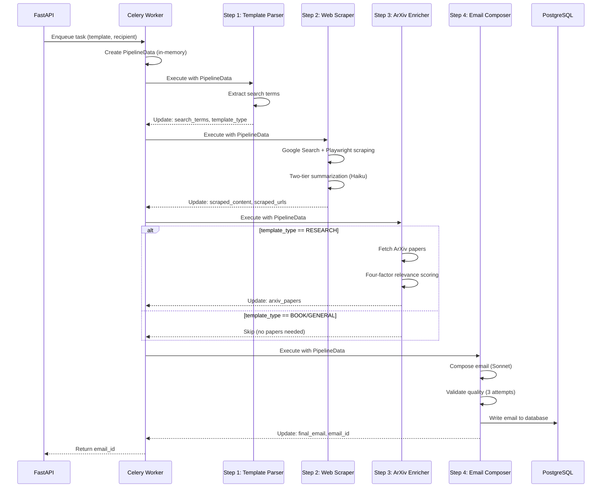

# Scribe Pipeline - Deep Dive

> **Complete technical guide to the 4-step email generation pipeline: architecture, data flow, and implementation details.**

---

## Overview

The Scribe pipeline transforms a simple email template into a personalized, research-backed outreach email through **4 sequential steps**:

1. **Template Parser** - Analyze template and extract search terms
2. **Web Scraper** - Fetch and summarize relevant information
3. **ArXiv Enricher** - Conditionally fetch academic papers
4. **Email Composer** - Generate final email and persist to database

**Execution Time**: 10-25 seconds (varies by template complexity)
**Architecture**: Stateless in-memory processing with single database write
**Observability**: Full distributed tracing via Logfire

---

## Pipeline Architecture

### Stateless Design Philosophy

**Key Principle**: All pipeline state lives in a single `PipelineData` object passed through each step. No intermediate database writes—only the final email is persisted.

```python
# In-memory state container
@dataclass
class PipelineData:
    # Inputs
    task_id: str
    user_id: str
    email_template: str
    recipient_name: str
    recipient_interest: str

    # Step outputs (populated during execution)
    search_terms: List[str] = field(default_factory=list)       # Step 1
    scraped_content: str = ""                                   # Step 2
    arxiv_papers: List[Dict] = field(default_factory=list)      # Step 3
    final_email: str = ""                                       # Step 4

    # Metadata for final DB write
    metadata: Dict[str, Any] = field(default_factory=dict)
```

**Benefits**:
- **Performance**: No I/O between steps, all operations in RAM
- **Simplicity**: Only 1 database write per pipeline execution
- **Scalability**: Workers scale horizontally with no DB bottleneck
- **Observability**: Logfire captures full execution history without DB writes

### Pipeline Data Flow



---

## Core Components

### PipelineData Structure

The `PipelineData` dataclass is the **single source of truth** during pipeline execution.

**File**: `pipeline/models/core.py`

```python
@dataclass
class PipelineData:
    """Shared state passed between all pipeline steps."""

    # ===== INPUT DATA (from API request) =====
    task_id: str                    # Celery task ID for correlation
    user_id: str                    # User ID from JWT token
    email_template: str             # Template with {{placeholders}}
    recipient_name: str             # e.g., "Dr. Jane Smith"
    recipient_interest: str         # e.g., "machine learning"

    # ===== STEP 1 OUTPUTS (TemplateParser) =====
    search_terms: List[str] = field(default_factory=list)
    template_type: TemplateType | None = None  # RESEARCH/BOOK/GENERAL
    template_analysis: Dict[str, Any] = field(default_factory=dict)

    # ===== STEP 2 OUTPUTS (WebScraper) =====
    scraped_content: str = ""       # Summarized content (max 3000 chars)
    scraped_urls: List[str] = field(default_factory=list)
    scraping_metadata: Dict[str, Any] = field(default_factory=dict)

    # ===== STEP 3 OUTPUTS (ArxivEnricher) =====
    arxiv_papers: List[Dict[str, Any]] = field(default_factory=list)
    enrichment_metadata: Dict[str, Any] = field(default_factory=dict)

    # ===== STEP 4 OUTPUTS (EmailComposer) =====
    final_email: str = ""
    composition_metadata: Dict[str, Any] = field(default_factory=dict)

    # ===== METADATA (for DB write) =====
    metadata: Dict[str, Any] = field(default_factory=dict)

    # ===== TRANSIENT DATA (Logfire only) =====
    started_at: datetime = field(default_factory=datetime.utcnow)
    step_timings: Dict[str, float] = field(default_factory=dict)
    errors: List[str] = field(default_factory=list)
```

**Why Dataclass over Pydantic Model?**
- Lighter weight (no validation overhead during execution)
- Faster instantiation
- Validation only at API boundary (request/response)

### BasePipelineStep Pattern

All pipeline steps inherit from `BasePipelineStep` abstract class.

**File**: `pipeline/core/runner.py`

```python
class BasePipelineStep(ABC):
    """Abstract base class for all pipeline steps."""

    async def execute(
        self,
        pipeline_data: PipelineData,
        progress_callback: Optional[Callable] = None
    ) -> StepResult:
        """
        Execute step with full observability.

        Wraps _execute_step() with:
        - Logfire span creation
        - Error handling and logging
        - Timing metrics
        - Progress callbacks
        """
        with logfire.span(f"pipeline.{self.step_name}", task_id=pipeline_data.task_id):
            try:
                # Validate input prerequisites
                validation_error = await self._validate_input(pipeline_data)
                if validation_error:
                    raise ValidationError(validation_error)

                # Execute step logic
                result = await self._execute_step(pipeline_data)

                # Record timing
                duration = time.time() - start_time
                pipeline_data.add_timing(self.step_name, duration)

                return result
            except Exception as e:
                logfire.error(f"{self.step_name} failed", error=str(e), exc_info=True)
                raise StepExecutionError(self.step_name, e)

    @abstractmethod
    async def _execute_step(self, pipeline_data: PipelineData) -> StepResult:
        """Step-specific logic - must be implemented by each step."""
        pass
```

**Benefits**:
- Consistent error handling across all steps
- Automatic Logfire instrumentation
- Timing metrics collected uniformly
- Clean separation of concerns

---

## Step 1: Template Parser

### Purpose

Analyze the email template to:
1. Extract search terms for web scraping
2. Classify template type (RESEARCH/BOOK/GENERAL)
3. Identify placeholders ({{name}}, {{research}}, etc.)

### Configuration

- **Model**: Claude Haiku 4.5 (fast, structured output)
- **Temperature**: 0.1 (consistent classification)
- **Execution Time**: ~1.2 seconds
- **File**: `pipeline/steps/template_parser/main.py`

### Implementation

```python
class TemplateParserStep(BasePipelineStep):
    """Analyze template and extract search parameters."""

    async def _execute_step(self, data: PipelineData) -> StepResult:
        # Create Pydantic-AI agent for structured output
        agent = create_agent(
            model="anthropic:claude-haiku-4-5",
            output_type=TemplateAnalysis,  # Pydantic model
            temperature=0.1,
            max_tokens=2000
        )

        # Prompt for structured analysis
        prompt = f"""
        Analyze this email template and recipient information:

        Template: {data.email_template}
        Recipient: {data.recipient_name}
        Interest: {data.recipient_interest}

        Extract:
        1. Search terms for finding information about the recipient
        2. Template type (RESEARCH if mentions papers, BOOK if mentions books, else GENERAL)
        3. Placeholders used ({{name}}, {{research}}, etc.)
        """

        # Execute with Logfire instrumentation
        result = await agent.run(prompt)

        # Update PipelineData
        data.search_terms = result.data.search_terms
        data.template_type = result.data.template_type
        data.template_analysis = result.data.model_dump()

        return StepResult(success=True, step_name=self.step_name)
```

### Output Example

```python
{
    "search_terms": [
        "Dr. Jane Smith machine learning healthcare",
        "Jane Smith publications",
        "Jane Smith research papers"
    ],
    "template_type": "RESEARCH",
    "placeholders": ["name", "research"],
    "confidence": 0.95
}
```

---

## Step 2: Web Scraper

### Purpose

Fetch and summarize information about the recipient from the web.

### Configuration

- **Models**:
  - Batch Summarization: Claude Haiku 4.5 (per-page extraction)
  - Final Synthesis: Claude Haiku 4.5 (COT reasoning)
- **Execution Time**: ~5.3 seconds
- **Max Concurrent Scrapes**: 1 (memory constrained on 512MB RAM)
- **Max Pages**: 5 per search term
- **Final Output**: Max 3000 characters

### Two-Tier Summarization Architecture

**The Innovation**: For large content (>30K chars), use batch processing + synthesis to prevent information loss.

```mermaid
flowchart TD
    Content{Content Size?}
    Content -->|≤30K chars| Direct[Direct Summarization<br/>Claude Haiku<br/>Temp: 0.0]
    Content -->|>30K chars| Chunk[Smart Chunking<br/>Sentence-aware splitting<br/>30K per chunk]

    Chunk --> Batch[Batch Extraction<br/>Claude Haiku<br/>Extract facts + [PAGE X] markers]
    Batch --> Combine[Combine Batches<br/>Preserve markers]
    Combine --> Synthesis[Final Synthesis<br/>Claude Haiku + COT<br/>Multi-source verification]

    Direct --> Output[Summarized Content<br/>Max 3000 chars]
    Synthesis --> Output

    style Synthesis fill:#e1f5ff
    style Batch fill:#fff4e1
    style Direct fill:#e8f5e9
```

### Anti-Hallucination Safeguards

1. **Multi-source verification**: Facts must appear in multiple pages
2. **Uncertainty markers**: `[UNCERTAIN]` when single source only
3. **Zero temperature**: Deterministic extraction from batch summaries
4. **Chain-of-thought**: Synthesis step reasons about fact validity
5. **Source attribution**: `[PAGE X]` markers track information origin

### Implementation Details

```python
class WebScraperStep(BasePipelineStep):
    """Fetch and summarize web content."""

    async def _execute_step(self, data: PipelineData) -> StepResult:
        all_pages = []

        # 1. Google Custom Search (2 results per search term)
        for term in data.search_terms[:3]:  # Max 3 search terms
            urls = await self._google_search(term, max_results=2)

            # 2. Playwright scraping (headless Chromium)
            for url in urls:
                try:
                    content = await self._scrape_with_playwright(url)
                    all_pages.append({"url": url, "content": content})
                except Exception as e:
                    logfire.warning(f"Failed to scrape {url}", error=str(e))

        # 3. Summarization (two-tier if needed)
        combined_content = "\n\n".join([p["content"] for p in all_pages])

        if len(combined_content) > 30_000:
            # Two-tier: batch + synthesis
            summary = await self._two_tier_summarization(combined_content, all_pages)
        else:
            # Direct summarization
            summary = await self._direct_summarization(combined_content)

        # Update PipelineData
        data.scraped_content = summary[:3000]  # Enforce max length
        data.scraped_urls = [p["url"] for p in all_pages]

        return StepResult(success=True, step_name=self.step_name)

    async def _two_tier_summarization(self, content: str, pages: List[Dict]) -> str:
        """Two-tier summarization for large content."""

        # Phase 1: Batch extraction (Haiku, temp 0.0)
        chunks = self._smart_chunk(content, chunk_size=30_000)
        batch_summaries = []

        for i, chunk in enumerate(chunks):
            batch_agent = create_agent(
                model="anthropic:claude-haiku-4-5",
                temperature=0.0,  # Deterministic
                max_tokens=2000
            )

            prompt = f"""
            Extract ALL factual information about the recipient from this content.
            Mark each fact with [PAGE {i+1}] to track source.

            Content:
            {chunk}

            Be exhaustive - include ALL mentions of:
            - Professional positions
            - Research areas
            - Publications
            - Achievements
            """

            result = await batch_agent.run(prompt)
            batch_summaries.append(result.data)

        # Phase 2: Synthesis with multi-source verification (Haiku + COT)
        synthesis_agent = create_agent(
            model="anthropic:claude-haiku-4-5",
            temperature=0.2,  # Slight creativity for synthesis
            max_tokens=3000
        )

        combined_batches = "\n\n".join(batch_summaries)

        synthesis_prompt = f"""
        Synthesize this information about the recipient using chain-of-thought reasoning.

        Batch Summaries:
        {combined_batches}

        Requirements:
        1. Only include facts that appear in multiple [PAGE X] markers
        2. Mark facts from single source as [UNCERTAIN]
        3. Prioritize: current position, recent work, publications
        4. Max 3000 characters

        Think step-by-step:
        - Which facts are confirmed by multiple sources?
        - What is most relevant for cold email outreach?
        - Are there any contradictions?
        """

        result = await synthesis_agent.run(synthesis_prompt)
        return result.data
```

### Smart Chunking Algorithm

**Goal**: Split content at sentence boundaries, not mid-sentence.

```python
def _smart_chunk(self, content: str, chunk_size: int = 30_000) -> List[str]:
    """Split content at sentence boundaries."""
    chunks = []
    current_pos = 0

    while current_pos < len(content):
        # Try to split at chunk_size
        end_pos = min(current_pos + chunk_size, len(content))

        if end_pos == len(content):
            # Last chunk
            chunks.append(content[current_pos:])
            break

        # Look backward for sentence boundary (max 500 chars)
        sentence_endings = ['\n\n', '. ', '.\n', '! ', '!\n', '? ', '?\n']
        best_split = end_pos

        for i in range(end_pos, max(end_pos - 500, current_pos), -1):
            for ending in sentence_endings:
                if content[i:i+len(ending)] == ending:
                    best_split = i + len(ending)
                    break

        chunks.append(content[current_pos:best_split])
        current_pos = best_split

    return chunks
```

---

## Step 3: ArXiv Enricher

### Purpose

**Conditionally** fetch academic papers (only if `template_type == RESEARCH`).

### Configuration

- **Execution Time**: ~0.8 seconds (when executed)
- **Max Papers**: 5 most relevant
- **Non-fatal**: Pipeline continues even if ArXiv fails
- **File**: `pipeline/steps/arxiv_helper/main.py`

### Four-Factor Relevance Scoring

**Innovation**: Multi-dimensional scoring to select most relevant papers.

```python
def calculate_relevance_score(paper: Dict, recipient_name: str, interest: str) -> float:
    """Calculate paper relevance using four factors."""

    score = 0.0

    # Factor 1: Author Match (40% weight)
    authors = paper.get("authors", [])
    if any(recipient_name.lower() in author.lower() for author in authors):
        score += 0.4

        # Bonus: Primary author (first author)
        if recipient_name.lower() in authors[0].lower():
            score += 0.1

    # Factor 2: Topic Match (30% weight)
    abstract = paper.get("abstract", "").lower()
    interest_keywords = interest.lower().split()
    keyword_matches = sum(1 for keyword in interest_keywords if keyword in abstract)
    topic_score = min(keyword_matches / len(interest_keywords), 1.0)
    score += topic_score * 0.3

    # Factor 3: Recency (20% weight)
    published_year = paper.get("published_year", 2000)
    current_year = datetime.now().year
    years_old = current_year - published_year

    if years_old <= 2:
        recency_score = 1.0
    elif years_old <= 5:
        recency_score = 0.7
    else:
        recency_score = 0.3

    score += recency_score * 0.2

    return score
```

### Implementation

```python
class ArxivEnricherStep(BasePipelineStep):
    """Fetch academic papers from ArXiv."""

    async def _validate_input(self, data: PipelineData) -> Optional[str]:
        """Check if template requires papers."""
        if data.template_type != TemplateType.RESEARCH:
            # Skip this step - not needed for BOOK/GENERAL
            return "skip"
        return None

    async def _execute_step(self, data: PipelineData) -> StepResult:
        try:
            # Query ArXiv API
            papers = await self._fetch_arxiv_papers(
                author_name=data.recipient_name,
                max_results=20  # Fetch more, then filter
            )

            # Calculate relevance scores
            scored_papers = []
            for paper in papers:
                score = calculate_relevance_score(
                    paper,
                    data.recipient_name,
                    data.recipient_interest
                )
                paper["relevance_score"] = score
                scored_papers.append(paper)

            # Sort by score and take top 5
            scored_papers.sort(key=lambda p: p["relevance_score"], reverse=True)
            top_papers = scored_papers[:5]

            # Update PipelineData
            data.arxiv_papers = top_papers
            data.enrichment_metadata = {
                "papers_found": len(papers),
                "papers_selected": len(top_papers),
                "avg_relevance_score": sum(p["relevance_score"] for p in top_papers) / len(top_papers)
            }

            return StepResult(success=True, step_name=self.step_name)

        except Exception as e:
            # Non-fatal error - continue without papers
            logfire.warning("ArXiv fetch failed", error=str(e))
            data.arxiv_papers = []
            return StepResult(
                success=True,  # Still success, just no papers
                step_name=self.step_name,
                warnings=[f"ArXiv API error: {str(e)}"]
            )
```

---

## Step 4: Email Composer

### Purpose

Generate final personalized email and write to database.

### Configuration

- **Model**: Claude Sonnet 4.5 (high-quality creative writing)
- **Temperature**: 0.7 (creative but controlled)
- **Max Retries**: 3 attempts for quality validation
- **Execution Time**: ~3.1 seconds
- **File**: `pipeline/steps/email_composer/main.py`

### Three-Attempt Validation System

**Innovation**: Iterative generation with quality checks.

```python
class EmailComposerStep(BasePipelineStep):
    """Generate final email and write to database."""

    async def _execute_step(self, data: PipelineData) -> StepResult:
        composer_agent = create_agent(
            model="anthropic:claude-sonnet-4-5-20250929",
            temperature=0.7,
            max_tokens=2000
        )

        # Build context from all previous steps
        context = {
            "template": data.email_template,
            "recipient_name": data.recipient_name,
            "recipient_interest": data.recipient_interest,
            "scraped_content": data.scraped_content,
            "arxiv_papers": data.arxiv_papers[:3],  # Top 3 papers
            "template_type": data.template_type
        }

        # Attempt generation with validation (max 3 attempts)
        for attempt in range(1, 4):
            email = await self._generate_email(composer_agent, context)

            # Validate quality
            validation = self._validate_email(
                email=email,
                recipient_name=data.recipient_name,
                template_type=data.template_type,
                arxiv_papers=data.arxiv_papers
            )

            if validation.is_valid:
                # Success! Write to database
                email_id = await self._write_to_database(data, email)

                data.final_email = email
                data.metadata["email_id"] = str(email_id)
                data.metadata["validation_attempts"] = attempt
                data.metadata["papers_used"] = [p["title"] for p in data.arxiv_papers]

                return StepResult(success=True, step_name=self.step_name)

            # Log validation failure
            logfire.warning(
                f"Email validation failed (attempt {attempt}/3)",
                issues=validation.issues,
                warnings=validation.warnings
            )

            # Retry with feedback
            context["validation_feedback"] = validation.issues

        # All attempts exhausted - use last attempt with warnings
        email_id = await self._write_to_database(data, email)

        data.final_email = email
        data.metadata["email_id"] = str(email_id)
        data.metadata["validation_warnings"] = validation.issues

        return StepResult(
            success=True,
            step_name=self.step_name,
            warnings=["Email generated but failed validation checks"]
        )
```

### Email Validation Logic

```python
def _validate_email(
    self,
    email: str,
    recipient_name: str,
    template_type: TemplateType,
    arxiv_papers: List[Dict]
) -> EmailValidationResult:
    """Validate email quality."""

    issues = []
    warnings = []

    # 1. Length checks
    if len(email) < 50:
        issues.append("Email too short (< 50 chars)")
    if len(email) > 10_000:
        issues.append("Email too long (> 10K chars)")

    # 2. Placeholder detection (should be filled)
    placeholders = ["{{", "}}", "[...]", "[INSERT", "[YOUR"]
    if any(ph in email for ph in placeholders):
        issues.append("Email contains unfilled placeholders")

    # 3. Recipient name verification
    if recipient_name not in email:
        issues.append(f"Email does not mention recipient name: {recipient_name}")

    # 4. Publication mentions (for RESEARCH type)
    if template_type == TemplateType.RESEARCH and arxiv_papers:
        paper_titles = [p["title"] for p in arxiv_papers]
        mentions_publication = any(
            self._fuzzy_match(title, email) for title in paper_titles
        )

        if not mentions_publication:
            warnings.append("Email doesn't mention any research papers")

    # 5. Generic phrase detection
    generic_phrases = [
        "your impressive work",
        "your research",
        "your work",
        "I came across your profile"
    ]
    generic_count = sum(1 for phrase in generic_phrases if phrase.lower() in email.lower())

    if generic_count > 2:
        warnings.append(f"Email contains {generic_count} generic phrases")

    # 6. Word count
    word_count = len(email.split())
    if word_count < 50:
        issues.append(f"Email too brief ({word_count} words)")

    return EmailValidationResult(
        is_valid=len(issues) == 0,
        issues=issues,
        warnings=warnings,
        mentions_publications=mentions_publication if template_type == TemplateType.RESEARCH else None,
        word_count=word_count
    )
```

### Database Write (Atomic Transaction)

```python
async def _write_to_database(self, data: PipelineData, email: str) -> uuid.UUID:
    """Write final email to PostgreSQL."""

    # Use async session from dependency injection
    async with self.db_session() as session:
        # Create email record
        email_record = Email(
            user_id=uuid.UUID(data.user_id),
            recipient_name=data.recipient_name,
            recipient_interest=data.recipient_interest,
            email_message=email,
            template_type=data.template_type.value,
            metadata={
                "search_terms": data.search_terms,
                "scraped_urls": data.scraped_urls,
                "arxiv_papers": [
                    {"title": p["title"], "url": p["url"]}
                    for p in data.arxiv_papers
                ],
                "step_timings": data.step_timings,
                "generation_time": data.total_duration()
            }
        )

        session.add(email_record)

        # Increment user generation count
        user = await session.get(User, uuid.UUID(data.user_id))
        user.generation_count += 1

        # Commit transaction
        await session.commit()
        await session.refresh(email_record)

        return email_record.id
```

---

## Pipeline Execution Flow

### Celery Task Integration

**File**: `tasks/email_tasks.py`

```python
@celery_app.task(bind=True, name='tasks.generate_email')
async def generate_email_task(
    self,
    user_id: str,
    email_template: str,
    recipient_name: str,
    recipient_interest: str
):
    """Celery task that orchestrates pipeline execution."""

    task_id = self.request.id

    with logfire.span("celery.generate_email", task_id=task_id):
        try:
            # Create in-memory pipeline data
            pipeline_data = PipelineData(
                task_id=task_id,
                user_id=user_id,
                email_template=email_template,
                recipient_name=recipient_name,
                recipient_interest=recipient_interest
            )

            # Create pipeline runner
            runner = PipelineRunner()
            runner.register_step(TemplateParserStep())
            runner.register_step(WebScraperStep())
            runner.register_step(ArxivEnricherStep())
            runner.register_step(EmailComposerStep())

            # Progress callback for Celery state updates
            async def update_progress(step_name: str, status: str):
                self.update_state(
                    state='STARTED',
                    meta={
                        'current_step': step_name,
                        'step_status': status,
                        'step_timings': pipeline_data.step_timings
                    }
                )

            # Execute pipeline
            await runner.run(pipeline_data, progress_callback=update_progress)

            # Return result
            return {
                'email_id': pipeline_data.metadata['email_id'],
                'step_timings': pipeline_data.step_timings,
                'generation_time': pipeline_data.total_duration()
            }

        except Exception as e:
            logfire.error("Pipeline execution failed", task_id=task_id, error=str(e))
            raise
```

### PipelineRunner Orchestration

**File**: `pipeline/core/runner.py`

```python
class PipelineRunner:
    """Orchestrates sequential execution of pipeline steps."""

    def __init__(self):
        self.steps: List[BasePipelineStep] = []

    def register_step(self, step: BasePipelineStep) -> None:
        """Register a step for execution."""
        self.steps.append(step)

    async def run(
        self,
        pipeline_data: PipelineData,
        progress_callback: Optional[Callable] = None
    ) -> None:
        """
        Execute all registered steps sequentially.

        Raises:
            StepExecutionError: If any step fails
        """
        with logfire.span("pipeline.full_run", task_id=pipeline_data.task_id):
            for step in self.steps:
                # Execute step
                result = await step.execute(pipeline_data, progress_callback)

                # Check for fatal failure
                if not result.success:
                    raise PipelineExecutionError(
                        f"Pipeline failed at step: {step.step_name}"
                    )

                # Log warnings
                for warning in result.warnings:
                    logfire.warning(
                        f"{step.step_name} warning",
                        warning=warning,
                        task_id=pipeline_data.task_id
                    )

            logfire.info(
                "Pipeline completed successfully",
                task_id=pipeline_data.task_id,
                total_duration=pipeline_data.total_duration(),
                step_timings=pipeline_data.step_timings
            )
```

---

## Performance Characteristics

### Execution Time Breakdown

| Step | Avg Time | Variance | Bottleneck |
|------|----------|----------|------------|
| Template Parser | 1.2s | Low | LLM API call |
| Web Scraper | 5.3s | High | Playwright rendering |
| ArXiv Enricher | 0.8s | Low | ArXiv API response |
| Email Composer | 3.1s | Medium | LLM generation + validation |
| **Total** | **10.4s** | Medium | Network + LLM latency |

**Variance Factors**:
- Web Scraper: Depends on website complexity and JavaScript load time
- Email Composer: Validation retries can add 2-6s

### Memory Usage (512MB RAM)

```
Base Python + FastAPI:        ~80MB
Playwright Chromium:          ~150MB (when active)
Pipeline overhead:            ~50MB
LLM response caching:         ~30MB
Available buffer:             ~200MB
──────────────────────────────────
Total peak usage:             ~310MB (safe margin for 512MB limit)
```

**Memory Optimizations**:
- Sequential scraping (not parallel) to limit browser instances
- Smart chunking to avoid loading full content in memory
- Streaming LLM responses (not implemented yet)

### Cost Analysis (per email)

| Component | Tokens | Cost |
|-----------|--------|------|
| Template Parser (Haiku) | ~500 | $0.0004 |
| Web Scraper Batch (Haiku) | ~3000 | $0.0024 |
| Web Scraper Synthesis (Haiku) | ~2000 | $0.0016 |
| Email Composer (Sonnet) | ~1500 | $0.0225 |
| **Total** | **~7000** | **~$0.027** |

**Note**: Actual costs vary based on:
- Content length (affects scraper summarization)
- Number of validation attempts (Email Composer)
- Template complexity

---

## Error Handling & Resilience

### Error Categories

1. **Fatal Errors** (stop pipeline):
   - Template Parser fails (can't proceed without search terms)
   - Email Composer database write fails
   - Invalid input data (Pydantic validation)

2. **Non-Fatal Errors** (continue with degraded service):
   - Some URLs fail to scrape (continue with successful ones)
   - ArXiv API timeout (continue without papers)
   - Email validation warnings (still persist email)

### Retry Strategy

**Celery Task Retries**:
```python
@celery_app.task(
    bind=True,
    max_retries=3,
    default_retry_delay=60  # 1 minute
)
```

**Retry Backoff**:
- Attempt 1: Immediate
- Attempt 2: 60 seconds delay
- Attempt 3: 120 seconds delay
- Attempt 4: Fail permanently

**Retriable Errors**:
- External API failures (Anthropic, Google, ArXiv)
- Database connection errors
- Network timeouts

**Non-Retriable Errors**:
- Invalid input data (would fail again)
- User not found in database
- Quota exceeded errors

---

## Testing Strategy

### Unit Tests

```python
# Test individual step logic
@pytest.mark.asyncio
async def test_template_parser_extracts_search_terms():
    step = TemplateParserStep()
    data = PipelineData(
        task_id="test",
        user_id="user-123",
        email_template="Hey {{name}}, love {{research}}",
        recipient_name="Dr. Smith",
        recipient_interest="AI"
    )

    result = await step._execute_step(data)

    assert result.success
    assert len(data.search_terms) > 0
    assert data.template_type in [TemplateType.RESEARCH, TemplateType.BOOK, TemplateType.GENERAL]
```

### Integration Tests

```python
# Test full pipeline execution
@pytest.mark.integration
@pytest.mark.asyncio
async def test_full_pipeline_execution():
    runner = PipelineRunner()
    runner.register_step(TemplateParserStep())
    runner.register_step(WebScraperStep())
    runner.register_step(ArxivEnricherStep())
    runner.register_step(EmailComposerStep())

    data = PipelineData(...)

    await runner.run(data)

    assert data.final_email != ""
    assert data.metadata["email_id"] is not None
```

### Mocking Strategy

```python
# Mock external APIs for fast tests
@pytest.fixture
def mock_anthropic():
    with patch('anthropic.AsyncAnthropic') as mock:
        mock.return_value.messages.create = AsyncMock(
            return_value=MockResponse(...)
        )
        yield mock

@pytest.mark.asyncio
async def test_with_mocked_llm(mock_anthropic):
    # Test runs without real API calls
    ...
```

---

## Further Reading

- **Architecture**: [ARCHITECTURE.MD](ARCHITECTURE.MD) - System design and deployment
- **Quick Start**: [QUICKSTART.MD](QUICKSTART.MD) - Get running in 5 minutes
- **Development**: [DEVELOPMENT.MD](DEVELOPMENT.MD) - Dev workflows and debugging
- **API Reference**: [API_REFERENCE.MD](API_REFERENCE.MD) - API endpoint documentation

---

*Last updated: 2025-01-24*
